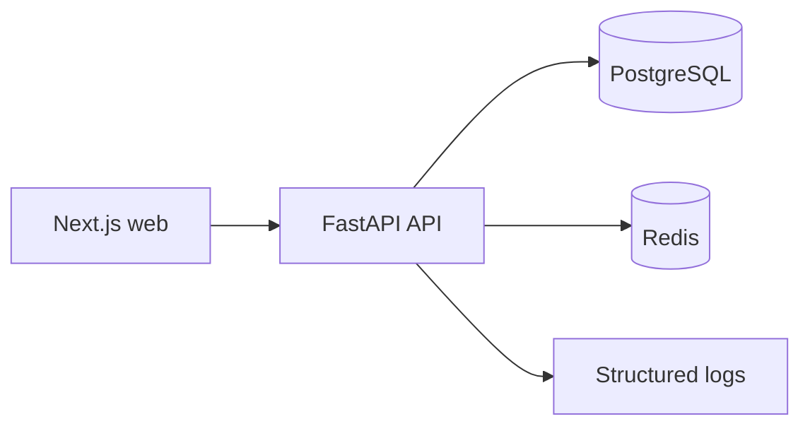

# InfraMind

> Infrastructure Intelligence Powered by AI

InfraMind is a cloud-native SaaS platform foundation for future intelligent Site Reliability Engineering workflows. Version `0.1.0` intentionally provides engineering infrastructure only—no authentication, monitoring, AI, dashboards, or operational business features.

## Architecture



The monorepo keeps deployable applications, reusable packages, infrastructure, and documentation independent. The API uses transport, application-service, domain, and infrastructure boundaries. See [Architecture.md](docs/Architecture.md).

## Folder structure

```text
apps/       Deployable web and API applications
packages/   Future shared UI, utilities, and TypeScript contracts
infra/      Container and deployment configuration
docs/       Architecture and engineering documentation
scripts/    Safe repository automation
```

## Tech stack

- Next.js, TypeScript, Tailwind CSS, TanStack Query, Zustand
- FastAPI, Pydantic Settings, SQLAlchemy 2, Alembic
- PostgreSQL, Redis, Docker Compose

## Local and Docker setup

1. Copy `.env.example` to `.env` and replace all development values as needed.
2. Install Docker Desktop with Compose support.
3. Start the platform:

   ```bash
   docker compose up --build
   ```

The web application is at `http://localhost:3000`; API documentation is at `http://localhost:8000/docs` in development.

## API health endpoints

- `GET /health` — legacy liveness endpoint retained for compatibility.
- `GET /health/ready` — legacy readiness endpoint retained for compatibility.
- `GET /api/v1/health` — versioned, standard-envelope liveness endpoint.
- `GET /api/v1/health/ready` — versioned dependency readiness endpoint.

## Development workflow

Use `make help` to see the standard local commands. `make up`, `make down`, `make build`, `make logs`, `make test`, `make lint`, and `make format` are available. Frontend-only commands use pnpm: `pnpm lint`, `pnpm typecheck`, and `pnpm build`.

Read [Development.md](docs/Development.md) and [CodingStandards.md](docs/CodingStandards.md) before contributing.

## Roadmap

The platform foundation is intended to support future tenancy, observability ingestion, deployment correlation, infrastructure topology, and AI-assisted investigation. These features are intentionally out of scope for this version.

## Screenshots

_Product screenshots will be added as user-facing capabilities are introduced._

## License

License terms are not yet defined. Do not assume open-source reuse rights until a license is added.

## Contributing

See [CONTRIBUTING.md](CONTRIBUTING.md).
